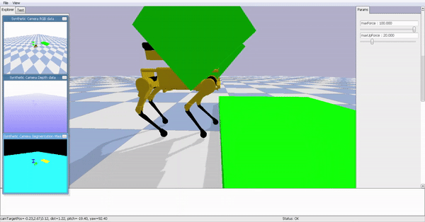

[](https://github.com/ToyasDhake/Modelling_Project/blob/master/LICENSE.txt)

# Modeling Project

## Overview

Simulation of four legged robot for modeling project for course ENPM662 
Introduction to Robot Modeling using Pybullet.

Main objective of the project is to perform forward and inverse kinematics on the legs and gripper
 of robot so that it can be used to get the legs and gripper in required orientation. Also, to 
 decide gait of the robot to walk but mostly focus will be on trot gait.

At the end robot is be able to pick and drop object, walk in straight line, climb and get down from an obstacle.


### Dependencies

- python 3.6 
- pybullet

### Demo Steps

Install Anaconda, for installation step see [Link](https://docs.anaconda.com/anaconda/install/)
```
conda create -n modeling python=3.6
conda activate modeling
pip install pybullet
git clone https://github.com/ToyasDhake/Modelling_Project.git
cd Modelling_Project
python LeggedRobot.py
```
### Report

Calculations performed for this project can be found in [Report](Final_Project_Toyas_Dhake.pdf)

## Result



Demo video [link](https://youtu.be/5Cuo5MBtMlU)

### Limitations

- Robot can only walk in straight line.
- Pace of the robot cannot be controlled.
- Robot cannot sense its environment.

### Copyright

Copyright (C) 2019 Toyas Dhake, Raghav Agrawal.

For license information, see [LICENSE.txt](LICENSE.txt).

### Contributors

-Toyas Dhake
-Robotics engineer, University of Maryland College Park.

-Raghav Agrawal
-Robotics engineer, University of Maryland College Park.
